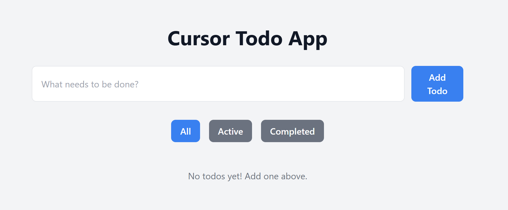

# Cursor Todo App

A modern, responsive Todo application built with Next.js, TypeScript, and Tailwind CSS. This project was created to learn and demonstrate the features of Cursor IDE while implementing best practices in modern web development.



## Features

- ✨ Add, complete, and delete todos
- 🔍 Filter todos by status (All/Active/Completed)
- 💾 Persistent storage using localStorage
- 🎨 Beautiful UI with Tailwind CSS
- 📱 Fully responsive design
- 🔒 Type-safe with TypeScript
- 🌟 Modern React patterns and hooks
- 🔄 Optimistic UI updates
- ⚡ Fast and lightweight

## Live Demo

[View the live demo](#) (We'll add this after deployment)

## Technologies Used

- [Next.js](https://nextjs.org/) - React framework for production-grade applications
- [TypeScript](https://www.typescriptlang.org/) - Static typing for better development experience
- [Tailwind CSS](https://tailwindcss.com/) - Utility-first CSS framework
- [React Icons](https://react-icons.github.io/react-icons/) - Popular icon library
- [UUID](https://www.npmjs.com/package/uuid) - Unique ID generation

## Getting Started

1. Clone the repository:
   ```bash
   git clone https://github.com/MKShots/cursor-todo-app.git
   ```

2. Install dependencies:
   ```bash
   cd cursor-todo-app
   npm install
   ```

3. Run the development server:
   ```bash
   npm run dev
   ```

4. Open [http://localhost:3000](http://localhost:3000) in your browser.

## Project Structure

```
cursor-todo-app/
├── src/
│   ├── app/
│   │   ├── components/     # Reusable React components
│   │   │   ├── TodoItem.tsx   # Individual todo item
│   │   │   └── TodoList.tsx   # Todo list with filtering
│   │   ├── types/         # TypeScript type definitions
│   │   │   └── todo.ts    # Todo and filter types
│   │   ├── globals.css    # Global styles and Tailwind
│   │   ├── layout.tsx     # Root layout component
│   │   ├── metadata.ts    # App metadata
│   │   └── page.tsx       # Main application page
│   └── ...
├── public/               # Static assets
├── tailwind.config.js   # Tailwind configuration
├── next.config.js       # Next.js configuration
├── package.json         # Dependencies and scripts
└── tsconfig.json        # TypeScript configuration
```

## Architecture Decisions

### State Management
- Uses React's built-in useState for local state management
- Implements localStorage for persistence
- Optimistic updates for better UX

### Component Structure
- Modular components for better maintainability
- Clear separation of concerns
- Type-safe props using TypeScript interfaces

### Styling Approach
- Tailwind CSS for utility-first styling
- Custom component classes for reusability
- Responsive design patterns

### Performance Considerations
- Client-side hydration handling
- Efficient state updates
- Optimized rendering with proper React patterns

## Features Demonstrated

This project showcases several key features:
- State management with React hooks
- Component composition
- TypeScript type safety
- Tailwind CSS styling
- Local storage persistence
- Responsive design
- Modern UI/UX practices

## Learning Outcomes

This project demonstrates several key features of Cursor IDE:
- Code intelligence and auto-completion
- File navigation and management
- TypeScript integration
- Terminal integration
- Git integration
- Component organization
- Real-time preview

## Future Improvements

Potential enhancements for the project:
- [ ] Add backend integration
- [ ] Implement user authentication
- [ ] Add due dates for todos
- [ ] Categories/tags for todos
- [ ] Dark mode support
- [ ] Drag and drop reordering
- [ ] Export/import functionality
- [ ] Unit and integration tests

## Contributing

Feel free to submit issues and enhancement requests! Follow these steps:
1. Fork the repository
2. Create a feature branch
3. Commit your changes
4. Push to the branch
5. Create a Pull Request

## Development Guidelines

- Follow TypeScript best practices
- Use functional components with hooks
- Write meaningful commit messages
- Update documentation for significant changes
- Maintain consistent code formatting

## License

MIT

## Author

[MKShots](https://github.com/MKShots)

## Acknowledgments

- Next.js team for the amazing framework
- Tailwind CSS team for the styling framework
- Cursor IDE team for the development environment
